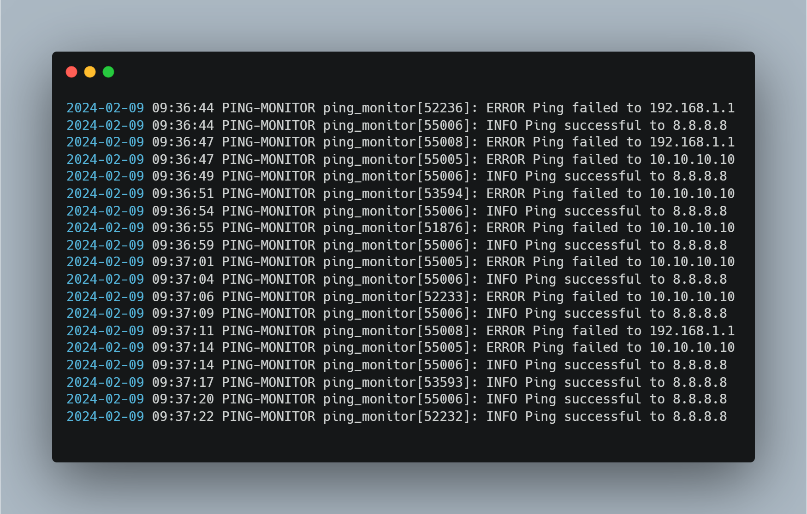

**## Ping Monitor**

### Overview

The Ping Monitor is a user-friendly script that diligently monitors the reachability of specified IP addresses at set intervals, logging the results for your convenience. You can run it as a systemd service for continuous monitoring.

### Supported Platforms

- Linux

### Download

Grab the Ping Monitor script using these commands:

```bash
wget https://github.com/mmwangi-eabx/ping-monitor/archive/refs/tags/alpha.zip
unzip alpha.zip && cd ping-monitor-alpha
```

### Installation and Configuration

**Preparation:**

- Ensure you have `wget` and `unzip` installed.

**Configuration:**

1. **Edit `ping_monitor.conf`:**

   ```bash
   sudo vi ping_monitor.conf
   ```

   Customize the following parameters:

   - **IP_ADDRESSES:** A space-separated list of IP addresses to monitor (e.g., `8.8.8.8 10.10.10.10 192.168.1.1`).
   - **INTERVALS:** Corresponding ping intervals in seconds for each IP address (e.g., `5 10 20`).
   - **LOG_FILE:** Path to the log file (e.g., `/var/log/ping_monitor/ping_monitor.log`).

2. **Example Values:**

   ```
   IP_ADDRESSES="8.8.8.8 10.10.10.10 192.168.1.1"
   INTERVALS="5 10 20"
   LOG_FILE="/var/log/ping_monitor/ping_monitor.log"
   ```

**Installation:**

1. Make the script executable:

   ```bash
   chmod +x install.sh
   ```

2. Run the installation script:

   ```bash
   sudo ./install.sh
   ```

### Usage

**Monitoring Status:**

```bash
sudo systemctl status ping_monitor.service
```

**Viewing Logs:**

```bash
cat /var/log/ping_monitor/ping_monitor.log
```

**Restarting Service:**

```bash
sudo systemctl restart ping_monitor.service
```

**Updating Configurations:**

1. Edit `ping_monitor.conf`.
2. Reload systemd and restart the service:

   ```bash
   sudo systemctl daemon-reload
   sudo systemctl restart ping_monitor.service
   ```

**Uninstallation:**

1. Make the script executable:

   ```bash
   chmod +x uninstall.sh
   ```

2. Run the uninstallation script:

   ```bash
   sudo ./uninstall.sh
   ```

### Features

- **Multiple IP Addresses:** Monitor numerous IP addresses concurrently with custom intervals.
- **Detailed Logging:** Timestamped logs record each ping attempt, success or failure.
- **Systemd Integration:** Run as a service for continuous background monitoring.
- **User-Friendly Configuration:** Define your monitoring preferences easily in `ping_monitor.conf`.

### Screenshots



### Troubleshooting

**Common Issues:**

- **Service not starting:** Check for errors in logs or typos in configurations.
- **Ping failures:** Verify network connectivity and IP addresses.
- **Log file unavailable:** Ensure permissions are set correctly.

**For additional assistance:**

- Open an issue on the project's GitHub repository.

### Contributing

Join us in improving Ping Monitor! You can contribute by:

- Reporting bugs and suggesting features.
- Submitting pull requests with code improvements.

### License

This project is licensed under the MIT License.